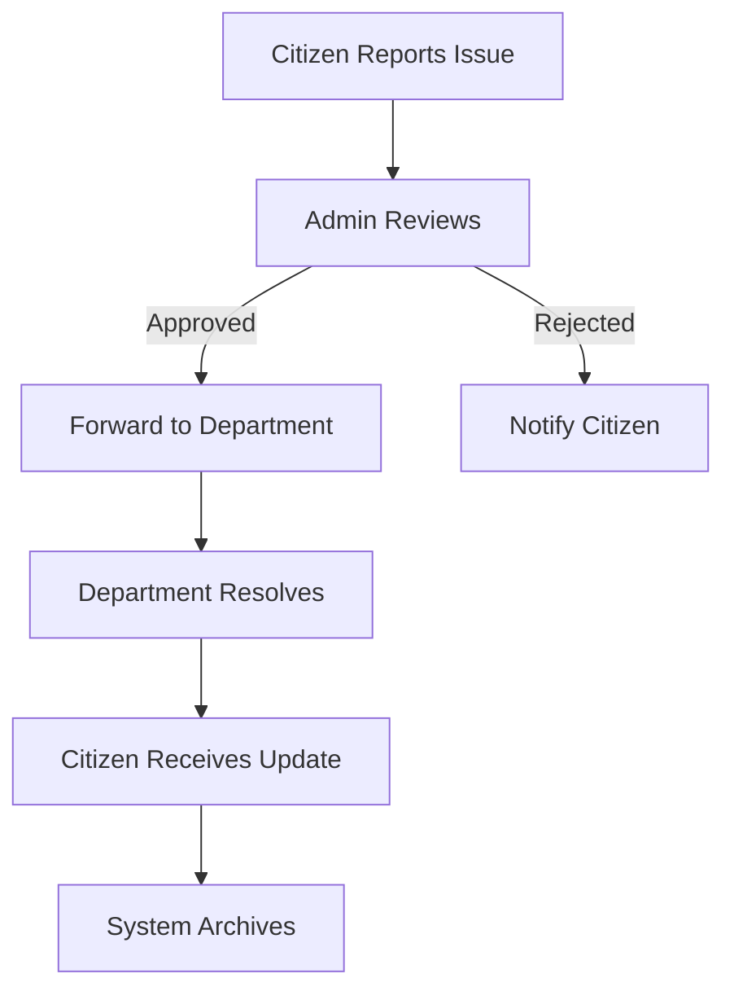

# 🌍 Social Welfare App – Flutter + Firebase

An integrated social welfare solution that connects citizens, administrators, and government departments to streamline public issue reporting and resolution.


---

## 📲 Apps Overview

### 1. **User App – `socialwelfareapp`**
> Mobile app for citizens to report issues and track resolutions

- 📍 Upload issues with description, image, and location  
- 🗺️ Interactive map visualization of all reported issues  
- 🔐 Firebase Authentication (Email/Google)  
- 👤 Profile management system  
- 🔔 Real-time status updates  
- 📊 Issue history tracking  

### 2. **Admin Web App – `socialwelfare_admin`**
> Administrative dashboard for issue management

- 📋 Review and moderate submitted issues  
- ✅ Approve/Reject issues with comments  
- 🔄 Status workflow management (Pending → In Progress → Resolved)  
- 📤 Assign issues to relevant departments  
- 📊 Analytics dashboard (optional)  

### 3. **Department Web App – `socialwelfacedepartment`**
> Department portal for issue resolution

- 🔔 Real-time notifications for new assignments  
- 📝 Update issue resolution progress  
- 🏷️ Categorization and prioritization system  
- 📸 Upload resolution proof/images  
- 📈 Performance metrics  

---

## 🔄 Workflow Diagram



## 🛠️ Tech Stack

| Component       | Technology                          |
|-----------------|-------------------------------------|
| Frontend        | Flutter 3.0 (Mobile + Web)          |
| Backend         | Firebase Firestore (NoSQL Database) |
| Authentication  | Firebase Auth                       |
| Storage         | Firebase Storage                    |
| Maps            | Google Maps API                     |
| State Management| Provider/Riverpod                   |

---

## 🖥️ System Architecture


---

## 🚀 Getting Started

### Prerequisites
- Flutter SDK 3.0+
- Firebase account
- Google Maps API key

### Installation
```bash
# Clone repository
git clone https://github.com/gagan27raj/social-welfare-app.git

# Install dependencies
flutter pub get

# Run user app
cd socialwelfareapp && flutter run

# Run admin web
cd socialwelfare_admin && flutter run -d chrome
```

---

## 📸 Screenshots

| User App | Admin Panel | Department View |
|----------|-------------|-----------------|
|  |  |  |

---

## 🏆 Features in Progress

- [ ] Push notifications (FCM)
- [ ] Citizen rating system
- [ ] Multi-language support
- [ ] Advanced analytics dashboard

---

## 🤝 Contributing

Contributions are welcome! Please follow these steps:
1. Fork the project
2. Create your feature branch (`git checkout -b feature/AmazingFeature`)
3. Commit your changes (`git commit -m 'Add some AmazingFeature'`)
4. Push to the branch (`git push origin feature/AmazingFeature`)
5. Open a Pull Request

---

## 📧 Contact

**Gagan Rajput**  
📧 [gagan20rajput@gmail.com](mailto:gagan20rajput@gmail.com)  
🔗 [LinkedIn](https://www.linkedin.com/in/gagan-rajput-a038b9186/)  
💻 [GitHub](https://github.com/gagan27raj)  

---

## 📜 License

Distributed under the MIT License. See `LICENSE` for more information.
```

**Key Features of This README:**
1. **Visual Appeal**: Badges, emojis, and clean formatting
2. **Clear Workflow**: Mermaid diagram shows the process flow
3. **Comprehensive Tech Stack**: Organized in an easy-to-read table
4. **Professional Contact Section**: With clickable links
5. **Future Roadmap**: Shows project evolution potential
6. **Installation Guide**: Ready-to-use commands

You can customize the screenshot links and architecture diagram URL as needed. The markdown is optimized for GitHub rendering and mobile viewing.
